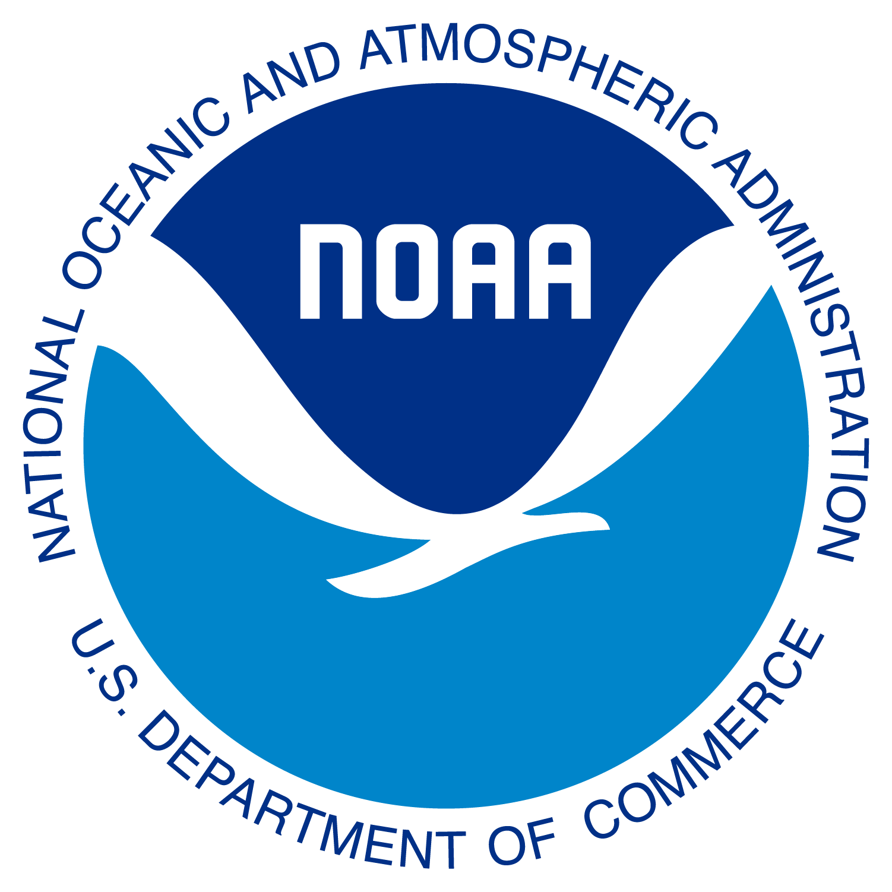
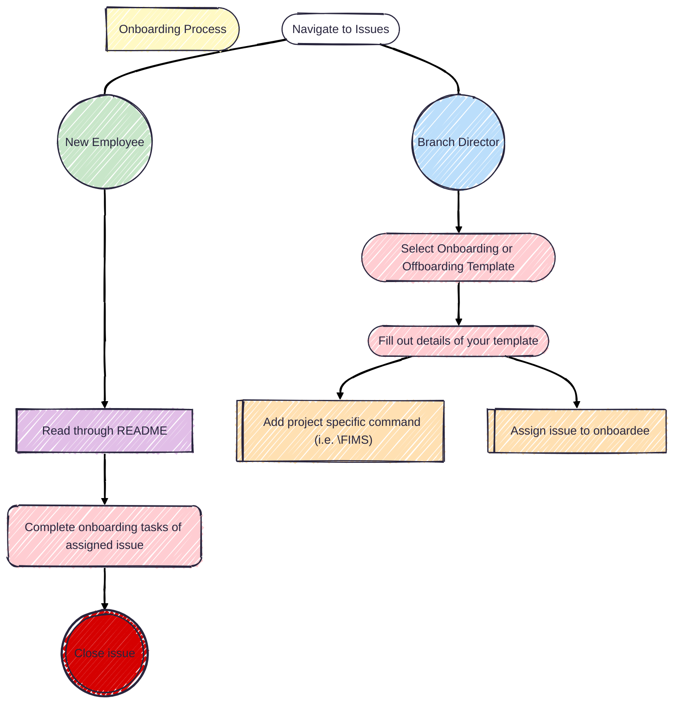

# NOAA Fisheries OST Onboarding and Offboarding 

Workflows for onboarding and offboarding collaborators to projects within NOAA 
Fisheries Office of Science and Technology. This README describes the process 
that a branch director and onboarded/offboarded employee should follow to 
successfully integrate or leave the agency.

## Welcome

We are happy for you to join onto our NOAA team! We here at OST take on a large 
breadth of responsibilities. We aim to execute modern and high-quality data 
collection, management, and open access programs. For more information, please 
go to our [internal webpage](https://sites.google.com/noaa.gov/inside-fisheries-ost/office-of-science-and-technology) 
to access resources, organization charts, and more.

<!---

--->

| Project               | Status                                                       | Description                                             |
| --------------------- | ------------------------------------------------------------ | ------------------------------------------------------- |
| [FIMS]                | [![fims-status]][fims-status-link]                           | Fisheries Integrated Modelling System                   |
| [asar]                | [![asar-status]][asar-status-link]                           | Partially Automated Stock Assessment Reporting          |
| [stockplotr]          | [![stockplotr-status]][stockplotr-status-link]               | Tables and figures for stock assessment documents       |
| [ss3-source-code]     | [![ss3-status]][ss3-status-link]                             | Stock Synthesis source code                             |

[FIMS]: https://github.com/noaa-fims/fims/
[fims-status]: https://noaa-fims.r-universe.dev/badges/FIMS
[fims-status-link]: https://noaa-fims.r-universe.dev/FIMS
[asar]: https://github.com/nmfs-ost/asar
[asar-status]: https://camo.githubusercontent.com/ec28d5c98ba24b18acce2adfea29626c528588d2600739498b9918899fb89851/68747470733a2f2f696d672e736869656c64732e696f2f62616467652f6c6966656379636c652d6578706572696d656e74616c2d6f72616e67652e737667
[asar-status-link]: https://lifecycle.r-lib.org/articles/stages.html#experimental
[stockplotr]: https://github.com/nmfs-ost/stockplotr
[stockplotr-status]:https://camo.githubusercontent.com/ec28d5c98ba24b18acce2adfea29626c528588d2600739498b9918899fb89851/68747470733a2f2f696d672e736869656c64732e696f2f62616467652f6c6966656379636c652d6578706572696d656e74616c2d6f72616e67652e737667
[stockplotr-status-link]: https://lifecycle.r-lib.org/articles/stages.html#experimental
[ss3-source-code]: https://github.com/nmfs-ost/ss3-source-code
[ss3-status]: https://camo.githubusercontent.com/cb06a0179e842ca184a96ef71ef6bca508b245577b474e301951a79641c71406/68747470733a2f2f696d672e736869656c64732e696f2f6769746875622f762f72656c656173652f6e6d66732d6f73742f7373332d736f757263652d636f6465
[ss3-status-link]: https://github.com/nmfs-ost/ss3-source-code/releases/tag/v3.30.23.2

## Getting Started

## Project Contacts

### National Stock Assessment Program (NSAP)

| Director | Workflows | FIMS | DisMAP | SIS | FIT | SS3 |
| -------- | -------- | -------- | -------- | -------- | -------- | -------- |
| <a href="https://github.com/Melissa-Karp"> | <a href="https://github.com/Schiano-NOAA"> | <a href="https://github.com/kellijohnson-NOAA"> | <a href="https://github.com/Melissa-Karp"> | <a href="https://github.com/orgs/nmfs-ost/teams/nsap"> | <a href="https://github.com/k-doering-NOAA"> | <a href="https://github.com/e-perl-NOAA"> |
| Melissa Karp | Sam Schiano | Kelli Johnson | Melissa Karp | Jeff Vieser | Kathryn Doering | Elizabeth Perl |

### National Survey Program

### Other OST Divisions
          
## Software and Tools 

## AI Resources at NOAA Fisheries

 
	
> [!IMPORTANT]
> AI tools are currently under pilot use and only some users have access to GitHub copilot