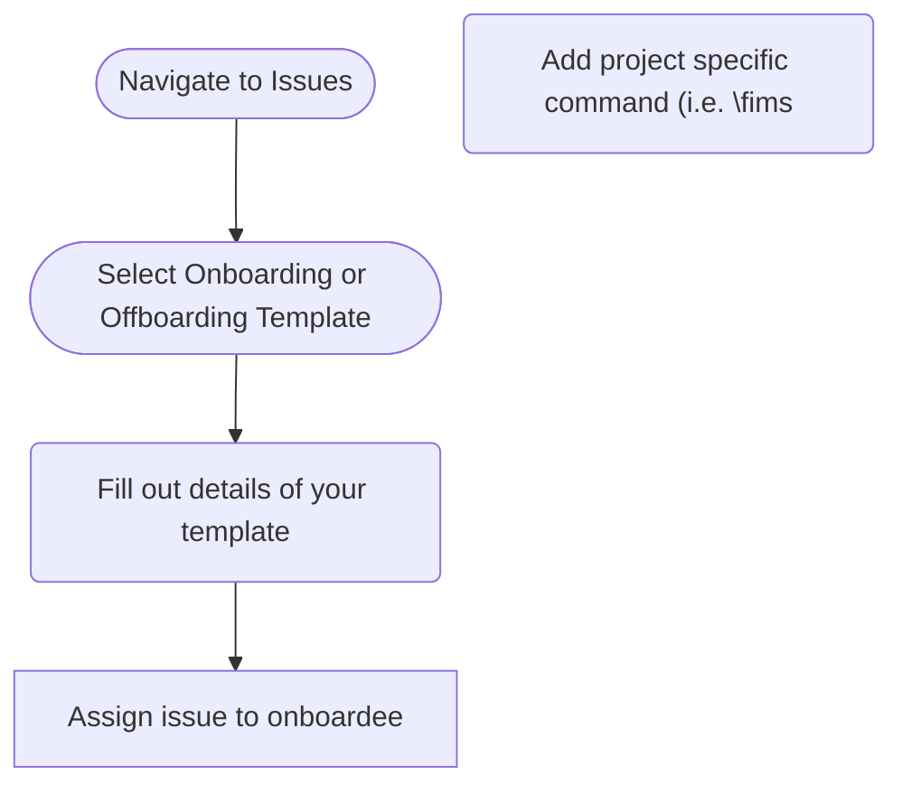

# on-off-boarding

Workflows for onboarding and offboarding collaborators to projects within NOAA Fisheries Office of Science and Technology

# Getting Started

```mermaid
flowchart TD;
    A(["Navigate to Issues"]);
    A --> B(["Select Onboarding or Offboarding Template"]);
    B --> C("Fill out details of your template");
    D("Add project specific command (i.e. \fims");
    C --> E["Assign issue to onboardee"];
```