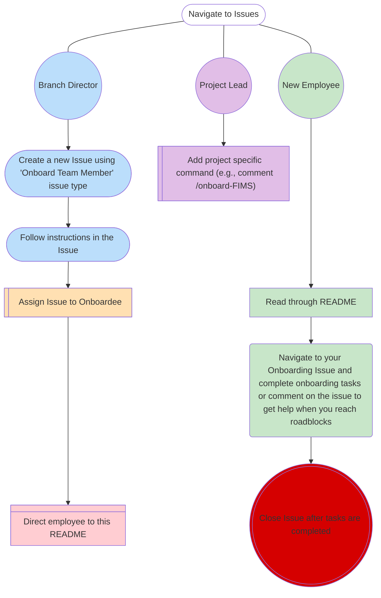

# NOAA Fisheries OST Onboarding and Offboarding 

This repository stores information about onboarding and offboarding collaborators to projects within NOAA Fisheries Office of Science and Technology (OST). This README describes the process that a branch director and onboarded/offboarded employee should follow to successfully integrate or leave the agency.

## 👋 Welcome

We are happy for you to join onto our team in NOAA! Here at OST, we take on a large breadth of responsibilities. We aim to execute modern and high-quality data collection, management, and open access programs. For more information, please go to our [internal webpage](https://sites.google.com/noaa.gov/inside-fisheries-ost/office-of-science-and-technology) to access resources, organization charts, and more.

Below is a table of some of our projects that we work on. See the next section on [Getting Started](#-getting-started) for how to join or add someone to one of these projects.

<!---

--->

| Project     | Stars                           | Status                              | Description                                             |
| ----------- | ----------- | ----------------------------------- | ------------------------------------------------------- |
| [FIMS] | ![fims-stars]               | [![fims-status]][fims-status-link]  | Fisheries Integrated Modelling System                   |
| [asar] | ![asar-stars]               | [![asar-status]][asar-status-link]  | Partially Automated Stock Assessment Reporting          |
| [stockplotr] | ![stockplotr-stars]   | [![stockplotr-status]][stockplotr-status-link] | Tables and figures for stock assessment documents       |
| [ss3-source-code] | ![ss3-stars]     | [![ss3-status]][ss3-status-link]    | Stock Synthesis source code                             |
| [DisMAP] | ![dismap-stars] | ![dismap-status] | Distribution Mapping and Analysis Portal |
| [FIT] | ![fit-stars] | ![fit-status] | Fisheries Integrated Toolbox |
| [journals] | ![journals-stars] | ![journals-status-link] | Bibliography files for journals of interest to fisheries |
| [nmfspalette] | ![nmfspalette-stars] | ![nmfspalette-status] | R Color palette for NOAA Fisheries official colors |

[FIMS]: https://github.com/noaa-fims/fims/
[fims-status]: https://noaa-fims.r-universe.dev/badges/FIMS
[fims-status-link]: https://noaa-fims.r-universe.dev/FIMS
[asar]: https://github.com/nmfs-ost/asar
[asar-status]: https://camo.githubusercontent.com/ec28d5c98ba24b18acce2adfea29626c528588d2600739498b9918899fb89851/68747470733a2f2f696d672e736869656c64732e696f2f62616467652f6c6966656379636c652d6578706572696d656e74616c2d6f72616e67652e737667
[asar-status-link]: https://lifecycle.r-lib.org/articles/stages.html#experimental
[stockplotr]: https://github.com/nmfs-ost/stockplotr
[stockplotr-status]:https://camo.githubusercontent.com/ec28d5c98ba24b18acce2adfea29626c528588d2600739498b9918899fb89851/68747470733a2f2f696d672e736869656c64732e696f2f62616467652f6c6966656379636c652d6578706572696d656e74616c2d6f72616e67652e737667
[stockplotr-status-link]: https://lifecycle.r-lib.org/articles/stages.html#experimental
[ss3-source-code]: https://github.com/nmfs-ost/ss3-source-code
[ss3-status]: https://camo.githubusercontent.com/cb06a0179e842ca184a96ef71ef6bca508b245577b474e301951a79641c71406/68747470733a2f2f696d672e736869656c64732e696f2f6769746875622f762f72656c656173652f6e6d66732d6f73742f7373332d736f757263652d636f6465
[ss3-status-link]: https://github.com/nmfs-ost/ss3-source-code/releases/tag/v3.30.23.2
[DisMAP]: https://apps-st.fisheries.noaa.gov/dismap/index.html
[dismap-status]: https://lifecycle.r-lib.org/articles/figures/lifecycle-stable.svg
[fit-status]: https://lifecycle.r-lib.org/articles/figures/lifecycle-stable.svg
[FIT]: https://nmfs-ost.github.io/noaa-fit/
[journals]: https://github.com/nmfs-ost/journals
[journals-status-link]: https://lifecycle.r-lib.org/articles/figures/lifecycle-experimental.svg
[nmfspalette]: https://github.com/nmfs-ost/nmfspalette
[nmfspalette-status]: https://github.com/nmfs-ost/nmfspalette/actions/workflows/call-r-cmd-check.yml/badge.svg

[fims-stars]: https://img.shields.io/github/stars/noaa-fims/fims?style=social
[asar-stars]: https://img.shields.io/github/stars/nmfs-ost/asar?style=social
[stockplotr-stars]: https://img.shields.io/github/stars/nmfs-ost/stockplotr?style=social
[ss3-stars]: https://img.shields.io/github/stars/nmfs-ost/ss3-source-code?style=social
[stars-badge]: https://img.shields.io/github/stars/nmfs-ost/fims?style=social
[dismap-stars]: https://img.shields.io/github/stars/nmfs-ost/DisMAP?style=social
[fit-stars]: https://img.shields.io/github/stars/nmfs-ost/noaa-fit-resources?style=social
[journals-stars]: https://img.shields.io/github/stars/nmfs-ost/journals?style=social
[nmfspalette-stars]: https://img.shields.io/github/stars/nmfs-ost/nmfspalette?style=social

## 👉 Getting Started

### Onboarding

## 📣 Project Contacts

### 🎏 National Stock Assessment Program (NSAP)

| Director | Workflows | FIMS | DisMAP | SIS | FIT | SS3 |
| -------- | -------- | -------- | -------- | -------- | -------- | -------- |
| <a href="https://github.com/Melissa-Karp"> | <a href="https://github.com/Schiano-NOAA"> | <a href="https://github.com/kellijohnson-NOAA"> | <a href="https://github.com/Melissa-Karp"> | <a href="https://github.com/orgs/nmfs-ost/teams/nsap"> | <a href="https://github.com/k-doering-NOAA"> | <a href="https://github.com/e-perl-NOAA"> |
| Melissa Karp | Sam Schiano | Kelli Johnson | Melissa Karp | Jeff Vieser | Kathryn Doering | Elizabeth Perl |

### 🎣 National Survey Program

### 🐟 Other OST Divisions
          
## 💻 Software and Tools 

## 💬 AI Resources at NOAA Fisheries

 
	
> [!IMPORTANT]
> AI tools are currently under pilot use and only some users have access to GitHub copilot