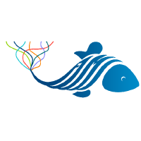
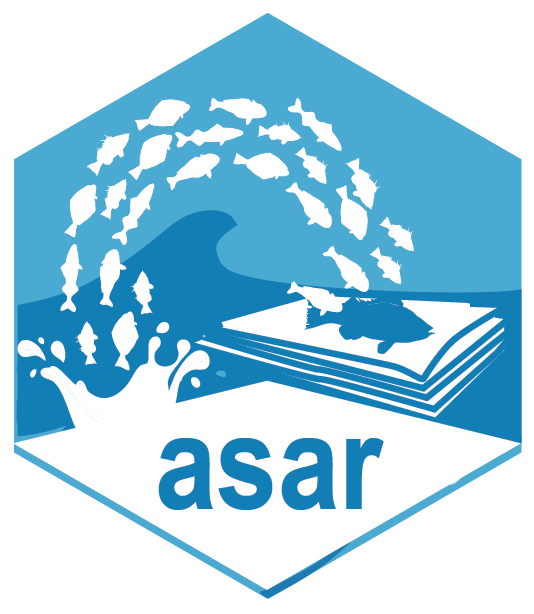
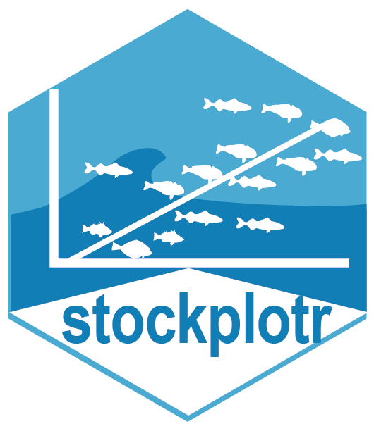

# NOAA Fisheries OST Onboarding and Offboarding 

Workflows for onboarding and offboarding collaborators to projects within NOAA 
Fisheries Office of Science and Technology. This README describes the process 
that a branch director and onboarded/offboarded employee should follow to 
successfully integrate or leave the agency.

## Welcome

We are happy for you to join onto our NOAA team! We here at OST take on a large 
breadth of responsibilities. We aim to execute modern and high-quality data 
collection, management, and open access programs. For more information, please 
go to our [internal webpage](https://sites.google.com/noaa.gov/inside-fisheries-ost/office-of-science-and-technology) 
to access resources, organization charts, and more.

<!---

--->

## Getting Started

## Project Contacts

### National Stock Assessment Program (NSAP)

|  |  | | | | | |
| ------- | ------ | -----| ------- | ------- | ------- | ------- |
| NSAP | Worflows | FIMS | DisMAP | SIS | FIT | SS3 |
| <a href="https://github.com/Melissa-Karp"> | <a href="https://github.com/Schiano-NOAA"> | <a href="https://github.com/kellijohnson-NOAA"> | <a href="https://github.com/Melissa-Karp"> | <a href="https://github.com/orgs/nmfs-ost/teams/nsap"> | <a href="https://github.com/k-doering-NOAA"> | <a href="https://github.com/e-perl-NOAA"> |
| Melissa Karp | Sam Schiano | Kelli Johnson | Melissa Karp | Jeff Vieser | Kathryn Doering | Elizabeth Perl |

## Software and Tools 

### National Survey Program

### Other OST Divisions
          
## AI Resources at NOAA Fisheries

 
	
> [!IMPORTANT]
> AI tools are currently under pilot use and only some users have access to GitHub copilot