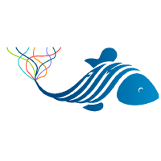
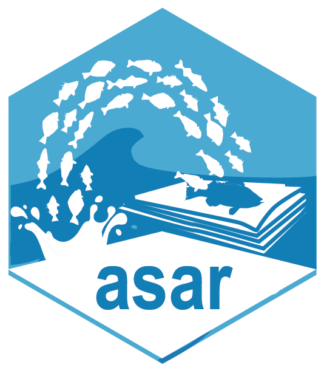
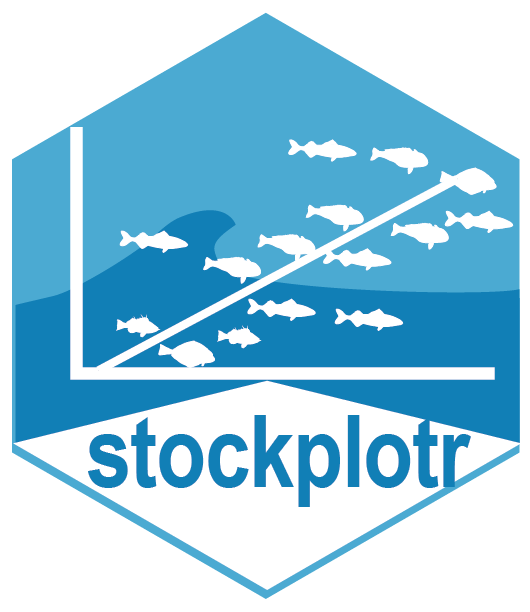

We use GitHub Issues to both onboard and offboard employees to OST and projects within OST. [Employee profiles](https://github.com/nmfs-ost/on-off-boarding/issues?q=is%3Aissue%20state%3Aopen%20label%3Aprofile) are tracked using GitHub Issues, and new profiles can be added by navigating to the [Profile Template](https://github.com/nmfs-ost/on-off-boarding/issues/new?template=add_new_profile.yml). Follow the instructions below to navigate creating a new profile and onboarding and offboarding employees to different divisions and projects.

# Onboarding

```{mermaid}
flowchart TD;
    A(["Navigate to Issues"]) --- A0(("Branch Director")) & A1(("New Employee")) & PL(("Project Lead"));
    A0 --> B(["Create a new Issue using 'Add new profile' issue type"]);
    A1 ----> G["Read through Getting Started Instructions"];
    B --> C(["Follow instructions in the Issue"]);
    C --> E["Assign Issue to Onboardee"];
    PL --> D["Add project specific command (e.g., comment /onboard-FIMS)"];
    G --> new("Navigate to your profile Issue and complete tasks or comment on the issue to get help when you reach roadblocks");
    new --> F["Complete all assigned tasks"];
    E ---> H["Direct employee to this site"];

    E@{ shape: lin-rect};
    D@{ shape: lin-rect};
    F@{ shape: dbl-circ};
    H@{ shape: div-rect};
    style A fill:transparent;
    style A0 fill:#BBDEFB;
    style A1 fill:#C8E6C9;
    style PL fill:#F54927,fill:#E1BEE7,color:none;
    style B fill:#BBDEFB;
    style G fill:#C8E6C9;
    style C fill:#BBDEFB;
    style E fill:#FFE0B2;
    style D fill:#E1BEE7;
    style new fill:#C8E6C9;
    style F fill:#D50000;
    style H fill:#FFCDD2;
    click A "https://github.com/nmfs-ost/on-off-boarding/issues";
    click A0 "https://github.com/nmfs-ost/on-off-boarding/issues/new?template=add_new_profile.yml";
    click G "/getting-started.qmd";
```

## Slash commands

Once a profile is created, an onboardee can be onboarded to a division or a project through the use of slash commands in Issue comments. When an Issue comment is started with, or only contains, a forward slash followed by "onboard-*", where the star must be replaced with a project name, e.g., "/onboard-sis", a task list will appear in the Issue with instructions and checkboxes for either the Onboardee, Project Lead, or Division Director to complete. These tasks lists are stored in the .github/workflows/ directory as .yml files. All task lists related to onboarding start with onboard and all task lists related to offboarding start with offboard. The filename without the extension reflects the name of the slash command.

If a new slash command is created, the command must have its own .yml file and the command must be listed in .github/workflows/slash-command-dispatch.yml. A big thank you to Peter Evans for creating [slash command dispatch](https://github.com/peter-evans/slash-command-dispatch) and maintaining it for us all to use.

# Offboarding

```{mermaid}
flowchart TD;
    A(["Navigate to Issues"]) --- A0(("Branch Director")) & A1(("Employee"));
    A0 --> B(["Execute command for offboarding from team and/or project"]);
    A1 ----> G["Read through offboarding task list"];
    B --> E["Reassign Issue to offboardee"];
    G --> F["Check off each task after it is completed"];
    E --> H["If employee is leaving ST4 and all offboarding tasks are complete, close out their profile"]

    E@{ shape: lin-rect};
    F@{ shape: dbl-circ};
    H@{ shape: div-rect};
    style A fill:transparent;
    style A0 fill:#BBDEFB;
    style A1 fill:#C8E6C9;
    style B fill:#BBDEFB;
    style G fill:#C8E6C9;
    style E fill:#FFE0B2;
    style F fill:#D50000;
    style H fill:#FFCDD2;
    click A "https://github.com/nmfs-ost/on-off-boarding/issues";
```

# 👥 Community
::: {#people}
:::

# Projects and Software

## 🗂️ Projects
::: {.callout-note}
Only projects that are associated with a GitHub repository are listed in the table below. There is an additional [list of projects](index.qmd#st4-projects-overview) on the home page which includes projects that do not have associated GitHub repositories.
:::

| Project | Stars | Status | Description |
|---------|-------|--------|-------------|
| [FIMS](https://github.com/noaa-fims/fims/) |  |  | Fisheries Integrated Modelling System |
| [asar](https://github.com/nmfs-ost/asar) |  |  | Partially Automated Stock Assessment Reporting |
| [stockplotr](https://github.com/nmfs-ost/stockplotr) |  |  | Tables and figures for stock assessment documents |
| [ss3-source-code](https://github.com/nmfs-ost/ss3-source-code) |  |  | Stock Synthesis source code |
| [DisMAP](https://apps-st.fisheries.noaa.gov/dismap/index.html) |  |  | Distribution Mapping and Analysis Portal |
| [FIT](https://nmfs-ost.github.io/noaa-fit/) |  |  | Fisheries Integrated Toolbox |
| [journals](https://github.com/nmfs-ost/journals) |  | [](https://lifecycle.r-lib.org/articles/figures/lifecycle-experimental.svg) | Bibliography files for journals of interest to fisheries |
| [nmfspalette](https://github.com/nmfs-ost/nmfspalette) |  |  | R Color palette for NOAA Fisheries official colors |

## 💻 Software and Tools 

<p>





</p>

### IDEs

#### Positron

Instructions for [installing Positron](https://positron.posit.co/install.html) can be found on the [Positron website](https://positron.posit.co), where Positron is the successor of RStudio and is built as an [Electron](https://electronjs.org/) app, the same as [VS Code](https://code.visualstudio.com/).

#### RStudio

Download the latest version of RStudio from [Posit's](https://posit.co) [download page](https://posit.co/downloads/)

#### Visual Studio Code

[Visual Studio Code (VS Code)](https://code.visualstudio.com/) is an [Electron](https://electronjs.org/) app that is meant to facilitate coding in any language. To download the latest version navigate to their [download page](https://code.visualstudio.com/Download) and follow the instructions specific to your operating system.

### WSL

Windows Subsystem for Linux (WSL) allows developers to run a Linux on your personal machine without having to use a dual-boot setup. This install takes help from the IT department if you are working on a NOAA-issued computer.

#### :hammer: Install WSL2 and Docker Engine

- Install WSL2 and Docker Engine on the Windows machine with IT. Both tools are on the [approved software list](https://docs.google.com/spreadsheets/d/1oPaTegdBGEmkjrmkbOVjGAJpPFg755p3Wws50ddLwCI/edit?usp=sharing).
- For installation details, see the official [WSL documentation](https://learn.microsoft.com/en-us/windows/wsl/install) and [Docker documentation](https://docs.docker.com/engine/install/).
- Be sure to have IT "Turn Windows features on or off" for WSL on Windows in addition to installing it. Here are some [similar instructions](https://www.tenforums.com/tutorials/46769-enable-disable-windows-subsystem-linux-wsl-windows-10-a.html) to what IT will need to do.

#### :hammer: Install VS Code and extensions

Open VS Code and install the following extensions from the Extensions view
(`Ctrl + Shift + X`):
- WSL extension (ID: ms-vscode-remote.remote-wsl): allows VS Code to connect to the WSL2 environment.
- Dev Containers extension (ID: ms-vscode-remote.remote-containers): builds and manages development containers from the `.devcontainers/devcontainer.json` file.

#### :hammer: Install Ubuntu

- Open a Windows Command Prompt and check if `Ubuntu` is listed as a WSL distribution:

```bash
wsl --list --verbose
```

If `Ubuntu` is not listed under the `NAME` column, run the following command
to install it:
Ubuntu: 
```Bash
wsl --install -d Ubuntu
```

## 💬 AI Resources at NOAA Fisheries

 

::: {.callout-important}
AI tools are currently under pilot use and only some users 
have access to GitHub copilot.
:::

## ☁️ Cloud Resources at NOAA Fisheries
