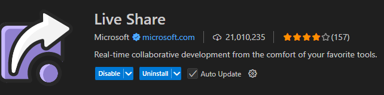

# Live Share Directions

## Installation

1. Make sure vs code is installed. You can have it on desktop or access via browser.
  > Download from https://code.visualstudio.com/
  
2. Install the Live Share extension in vs code.
  > nagivate to extensions
  > search "live share" by Microsoft
  > Install
  

  
3. Sign in to Live Share using your Microsoft or GitHub account.

*Sam will share the link to access the session and you should be able to access the repository and active script to work on.*

- Once you gain access make sure you have edit access. If you do not, let us know.